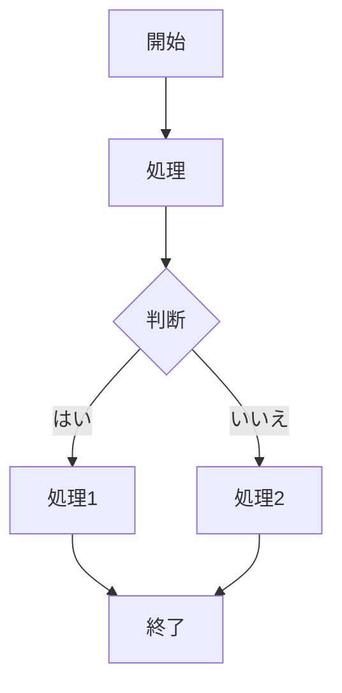

# 【Markdown記法】
 * テキストファイルの一種で、その記法によって「見出し」「箇条書き」「強調」「表」「画像」などを表現できる。
 * Markdownは拡張子が「md」のテキストファイル。そのため、Gitでの管理に適している。
 * Markdownは容易にHTMLに変換することができ、Webで利用するドキュメントの記述に使われている。
 * GitHub向けのドキュメントではMarkdownが使われる。
<br><br>

## ■記法一覧
| 項目                 | 記法                                     | 表示
|---------------------|------------------------------------------|--------------------------------------------------------------
| 見出し\<hx>          | 行頭に #                                 |
| 段落\<p>             | 何も付けない                             | テキスト<br>段落の途中で1行空けると **改行** し、段落が分かれる。
| 太字\<strong>        | \*\*太字1\*\*<br>\_\_太字2__             | **太字1**<br>__太字2__ 
| 斜体\<em>            | \*斜体1\*<br>\_斜体2\_                   | *斜体1*<br>_斜体2_
| 下線\<ins>           | \<ins>下線\</ins>                       | <ins>下線</ins>
| 下線\<u>             | \<u>下線\</u>                           | <u>下線</u>
| 打ち消し線            | \~\~打ち消し線\~\~                      | ~~打ち消し線~~
| インライン表示        | \`インライン表示\`                       | `インライン表示`
| 引用                 | > 引用1<br>>> 引用2                      | <blockquote>引用1<blockquote>引用2</blockquote></blockquote>
| ハイライト(背景色)    | \<mark>ハイライト\</mark>                | <mark>ハイライト</mark>
| 箇条書き             | 行頭に * (ｱｽﾀﾘｽｸ)<br>行頭に - (ﾊｲﾌﾝ)<br>インデントはタブ | * 箇条書き<br> - 箇条書き
|                      | \<details><br>&nbsp;&nbsp;&nbsp;\<summary>表示するテキスト\</summary><br>&nbsp;&nbsp;&nbsp;&nbsp;&nbsp;&nbsp;&nbsp;&nbsp;折りたたむ<br>&nbsp;&nbsp;&nbsp;&nbsp;（クリックしたら表示される）テキスト<br>\</details> | <details><summary>クリックで展開可能</summary>折りたたむ<br>（クリックしたら表示される）テキスト</details>
| コード挿入            | \``` <br>puts "Hello World!!"　<br>\``` | ``` puts "Hello World!!"　```
| シンタックスハイライト | ```コード                                | 
| 水平線                | ***                                     | グレーの水平線 (※2)
| リンク                | \[表示テキスト](URL "吹き出し")           | [Google](https://www.google.com/ "Google")
| 画像埋め込み           | \!\[テキスト](URL "吹き出し")            | 
| テーブル（表）         |                                         | 
| エスケープ            | \\\*イタリック*                          | \*イタリック*
| 注釈                  | 注釈[^1]                                | 

<br>

(※1)
# 見出し1
## 見出し2
### 見出し3
#### 見出し4
##### 見出し5
###### 見出し6

<br>

(※2) <br>
水平線
***
* * *
---
- - -
---------------------------------------

<br><br>

```php:alpaca_sample.php&nbsp;&nbsp;(2)
$a = 15;
if( $a < 10 ){
  echo "10より小さい \n";
} elseif( $a < 20 ){
  echo "10以上で 20より小さい \n";
} else {
  echo "30以上 \n";
}
```

<br>

## ■リスト
#### ・Disc型
文法： *　+　- テキスト〜<br>
インデントも使用できる
* テキスト
    * インデント：テキスト
        * インデント２：テキスト

#### ・Disc型
文法： 数字. テキスト〜
1. リスト１
2. リスト２ 
3. リスト３

#### ・Definition型
文法： HTMLの \<dl>タグ をそのまま使うことで実現できる
```
<dl>
  <dt>MacBookPro</dt>
  <dd>178,000円</dd>
  <dt>iPadPro</dt>
  <dd>128,000円</dd>
</dl>
```
<dl>
  <dt>MacBookPro</dt>
  <dd>178,000円</dd>
  <dt>iPadPro</dt>
  <dd>128,000円</dd>
</dl>

<br>

## ・Markdown記法とHTMLタグの対応
修飾	Markdown	HTML
ボールド	** **	<strong></strong>
イタリック	__　　__	<em></em>
インライン	``	<code></code>
リンク	[text](url)	<a href="url">text</a>
<br>

### ・Checkbox型
Disc型の記述の後ろに[ ]を入れるとチェックボックスが生成される。
チェックが入った状態のボックスを生成する場合は[x]を入力する。
前後にスペースが必要

```
- [ ] タスク１
- [x] タスク２
```
- [ ] タスク１
- [ ] タスク２

<br>

### ・テーブル記法（表）
文法： [ カラム数 ] x [ レコード数 ]
カラムが列（縦列）の数、レコードが行（横の行）の数ですが、レコード数に見出し行は含まれていません。

手書きは非効率過ぎるので、入力補完超オススメです。


見出し行（1行目）と最初のレコード行（3行目）の間に、
|:--|--:|:--:|
のような行が入りますが、コレは実際には表示されていません。
ですが、表内で表示される文字の位置に関係しています。
```
| header     | ヘッダー      |見出し       |
|:-----------|------------:|:------------:|
| 左寄せ      | 右寄せ      | 中央寄せ      |
| column     | column      | column       |
| *column*   | _column_    | **column**   |
| __column__ | `column`    | column       |
```
| header     | ヘッダー      |見出し       |
|:-----------|------------:|:------------:|
| 左寄せ      | 右寄せ      | 中央寄せ      |
| column     | column      | column       |
| *column*   | _column_    | **column**   |
| __column__ | `column`    | column       |

<br>

```
| Left align | Right align | Center align |
|:-----------|------------:|:------------:|
| This       | This        | This         |
| column     | column      | column       |
| will       | will        | will         |
| be         | be          | be           |
| left       | right       | center       |
| aligned    | aligned     | aligned      |
```
| Left align | Right align | Center align |
|:-----------|------------:|:------------:|
| This       | This        | This         |
| column     | column      | column       |
| will       | will        | will         |
| be         | be          | be           |
| left       | right       | center       |
| aligned    | aligned     | aligned      |

<br>

```ruby:qiita.rb
puts 'The best way to log and share programmers knowledge.'
```

<br>

```diff_javascript
- console.log("Hello");
+ console.log("World");
```

<br>

## ■数式
### ・ブロック数式
```math
\left( \sum_{k=1}^n a_k b_k \right)^{\!\!2} \leq
\left( \sum_{k=1}^n a_k^2 \right) \left( \sum_{k=1}^n b_k^2 \right)
```

```math
\begin{equation}
sushi=
\begin{pmatrix}
** & \cdots & \cdots & \cdots & \cdots & ** \\
\cdots & L & O & V & E & \cdots &\\
\cdots & A & N & D & \cdots & \cdots \\
\cdots & P & E & A & C & E \\
** & \cdots & \cdots & \cdots & \cdots & ** \\
\end{pmatrix}
\end{equation}
```
<br>

### ・インライン数式
$​と$​で囲むとインライン数式として表示できます。
x^2 + y^2 = 1 をインライン表示すると $`x^2 + y^2 = 1`$ になります。
$ e^{i\theta} = \cos\theta + i\sin\theta $
<br>

### ・1行数式
$$​と$$​で囲むと1行の数式として表示できます。

$$ e^{i\theta} = \cos\theta + i\sin\theta $$


<br>

## ■ダイアグラム
以下の方法で文章内に図を表示することができます

<br>

### ・PlantUMLを使う
コードブロックの言語名をplantumlとすることで、PlantUMLによるダイアグラムを表示することができます。
PlantUML記法でシーケンス図、コンポーネント図などのUMLを描画できます。
コードブロック記法に uml ラベルで PlantUML記法になります。

PlantUMLは、テキスト記述からUML（Unified Modeling Language）図を自動生成するオープンソースのツールです。ソフトウェア設計や要件定義の視覚化に広く使用されています。

PlantUMLの構文については公式サイトをご覧ください。
https://plantuml.com/ja/

```plantuml
Bob->Alice : Hello!
```

```uml
Alice -> Bob: Authentication Request
Bob --> Alice: Authentication Response

Alice -> Bob: Another authentication Request
Alice <-- Bob: another authentication Response
```

クラス間の関係や構造を表現する図です。
```uml
@startuml
class Car {
  - String model
  - int year
  + void start()
  + void stop()
}
class Driver {
  - String name
  + void drive(car)
}
Driver --> Car : drives
@enduml
```


### ・Mermaidを使う
Mermaid（マーメイド）とは、Markdownに似たシンプルなテキスト記法を利用して、動的な図やチャートを生成できるJavaScriptベースのツールです。


コードブロックの言語名をmermaidとすることで、Mermaidによるダイアグラムを表示することができます。


Mermaidで図を記述する際は、コードブロック内に「mermaid」言語識別子を指定し、その中に図の定義を記述します。以下は、シンプルなフローチャートの例です:


Mermaidの構文については公式サイトをご覧ください。
https://mermaid.js.org/#/
以下の記事でも使い方をまとめています。
https://qiita.com/Qiita/items/c07f3262d8f3b25f06c9


## ■pre記法（スペース4 or タブ）
半角スペース4個もしくはタブで、コードブロックをpre表示できます

	# Tab
	class Hoge
		def hoge
			print 'hoge'
		end
	end

    # Space
    class Hoge
      def hoge
        print 'hoge'
      end
    end

### ・GFM:pre記法（チルダ×3）
~~~
class Hoge
  def hoge
    print 'hoge'
  end
end
~~~

### ・GFM:pre記法（バッククォート×3）
```
class Hoge
  def hoge
    print 'hoge'
  end
end
```

### ・GFM:pre記法（シンタックスハイライト）
~~~ruby
class Hoge
  def hoge
    print 'hoge'
  end
end
~~~

### ・GFM:ページ内リンク
#### menu
* [to header1](#header1)
* [to header2](#header2)

<!-- some long code -->

[return to menu](#menu)
##### header1
##### header2
```
## menu
* [to header1](#header1)
* [to header2](#header2)

<!-- some long code -->

[return to menu](#menu)
### header1
### header2
```
↓少し省略してますが、こんなかんじのHTMLになります。
```
<h2><a name="user-content-menu" href="#menu">menu</a></h2>
<a href="#header1">to header1</a>
<a href="#header2">to header2</a>

<!-- some long code -->

<a href="#menu">to menu</a>
<h3><a name="user-content-header1" href="#header1">header1</a></h3>
<h3><a name="user-content-header2" href="#header2">header2</a></h3>
```


テキスト[^1]
[^1]: 注釈内容


<font color="Red">文字色</font>


`#ffce44`
`rgb(255,0,0)`
`rgba(0,255,0,0.4)`
`hsl(100, 10%, 10%)`
`hsla(100, 24%, 40%, 0.5)`


<section class="footnotes">
    <ol>
        <li id="fn-1">
        <p>注釈用テキスト。文末の矢印マークをクリックすると戻れます。
            <a  href="#fnref-1" class="">↩</a>
            <a href="#fnref-1-2" class="">↩<sup>2</sup></a>
        </p>
        </li>
    </ol>
</section>


[参考]
* [Markdown記法 サンプル一覧](https://qiita.com/jkjoluvjlajelljicvjzojieoaid/items/01cd7ff819bc2e69b652)<br>
* [Markdown記法/書き方（見出し・表・リンク・画像・文字色など）](https://help.notepm.jp/hc/ja/articles/17267311368729-Mermaid%E8%A8%98%E6%B3%95%E3%81%AE%E6%9B%B8%E3%81%8D%E6%96%B9-Markdown%E3%83%86%E3%82%AD%E3%82%B9%E3%83%88%E3%81%A7%E3%83%81%E3%83%A3%E3%83%BC%E3%83%88-%E3%82%B0%E3%83%A9%E3%83%95%E3%81%8C%E6%8F%8F%E3%81%91%E3%82%8B)<br>
* [Markdown記法 チートシート](https://qiita.com/Qiita/items/c686397e4a0f4f11683d)<br>
* [Markdown記法 サンプル集](https://qiita.com/tbpgr/items/989c6badefff69377da7)<br>
* [Qiita マークダウン記法 一覧表・チートシート](https://qiita.com/kamorits/items/6f342da395ad57468ae3)<br>
* [Markdown 表テーブルの書き方](https://help.docbase.io/posts/3718072)<br>
* [Mermaid (マーメイド) 記法と書き方](https://help.docbase.io/posts/3719897)<br>
* [PlantUML記法と書き方](https://help.docbase.io/posts/3720083)